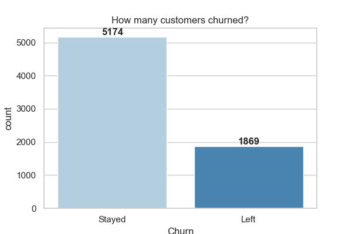

# Customer Segmentation & Retention Analysis

A complete end-to-end datavscience project that predicts customer churn, segments users by behaviour, and estimates customer lifetime value for a telecom company - all wrapped in an interactive Streamlit dashboard.

---

##  🔍 Problem Statement
Telecom companies lose millions every year to customer churn. This project answers three critical business questions:
- **Who is about to leave?**
- **How much are they worth?**
- **What should the business do about it?**

---

## 📊 Dashboard Preview



---

## 🛠️ What I Built

| Phase | What | File |
|-------|------|------|
| 1 | Data Exploration | `notebooks/01_explore.py` |
| 2 | Data Cleaning | `notebooks/02_clean.py` |
| 3 | Visualizations | `notebooks/03_visualize.py` |
| 4 | RFM Segmentation | `notebooks/04_rfm.py` |
| 5 | Churn Prediction Model | `notebooks/05_churn_model.py` |
| 6 | Customer Lifetime Value | `notebooks/06_clv.py` |
| 7 | Streamlit Dashboard | `app.py` |

---


## 🧠 Key Findings

- **26.5% churn rate** — 1 in 4 customers is leaving
- **Month-to-month customers churn at 43%** vs only 3% for 2-year contracts
- **New customers churn the most** — if you keep them past 6 months they rarely leave
- **Top churn predictors:** Total charges, monthly charges, tenure, and contract type
- **Model accuracy: 80%** with AUC-ROC of 0.836

---

## 💡 Business Recommendations

| Segment | Action |
|---------|--------|
| 🔴 High Risk + High Value | Offer discount or upgrade to annual contract immediately |
| 🟡 High Risk + Low Value | Automated campaigns only — not worth heavy spend |
| 🟢 Low Risk + High Value | Reward with loyalty perks to keep them happy |

---

## 🚀 How to Run

**1. Clone the repository**
```bash
git clone https://github.com/YOUR_USERNAME/customer-retention-project.git
cd customer-retention-project
```

**2. Install dependencies**
```bash
pip install -r requirements.txt
```

**3. Run the scripts in order**
```bash
python notebooks/01_explore.py
python notebooks/02_clean.py
python notebooks/03_visualize.py
python notebooks/04_rfm.py
python notebooks/05_churn_model.py
python notebooks/06_clv.py
```

**4. Launch the dashboard**
```bash
streamlit run app.py
```

---

## 📦 Dataset

[Telco Customer Churn Dataset](https://www.kaggle.com/datasets/blastchar/telco-customer-churn) 
from Kaggle — 7,043 customers, 21 features.

---

## 🧰 Tech Stack

- **Python** — pandas, numpy, matplotlib, seaborn
- **Machine Learning** — scikit-learn, RandomForestClassifier
- **Dashboard** — Streamlit
- **Dataset** — Kaggle Telco Churn
```

Save with **`Ctrl + S`**.

Now we also need a `requirements.txt` file so anyone can install your dependencies easily. Create a new file in the root called `requirements.txt` and paste this:
```
pandas
numpy
matplotlib
seaborn
scikit-learn
xgboost
shap
streamlit
